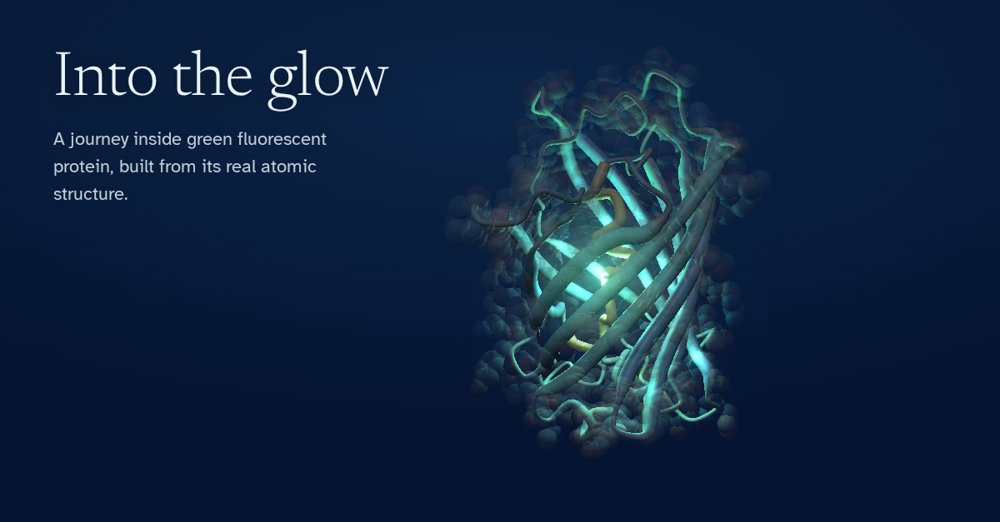

# Into the glow

A 3D journey inside green fluorescent protein (GFP), built from its real atomic structure.

**Take the journey:** https://jpinob.github.io/into-the-glow/



## What it is

Six stops, from the outside of the protein to the light hidden at its centre:

1. **Meet GFP.** All 1,771 atoms of the crystal structure. Tap an atom to see what it is, or hide atom types.
2. **A barrel of 11 strands.** The protein backbone, without the atoms.
3. **One single thread.** A light walks the chain from amino acid 2 to 229. Speed control, pause, and start and end markers.
4. **Down the middle.** The central stretch that runs through the barrel.
5. **The light source.** The chromophore at the centre. Switch the blue light on and off.
6. **Why it matters.** GFP as a tool to follow proteins inside living cells.

It runs in the browser, on desktop and on mobile. Drag to turn, scroll or pinch to zoom, right-drag or two fingers to move. On phones, "Hide text" folds the text card down to its title and buttons, so the model stays in view.

## How it was made

```
data/1ema.cif  ->  pipeline/prep.py  ->  data/gfp.json  ->  pipeline/build.py  ->  index.html
 (PDB, CC0)        gemmi + NumPy          ~42 KB             + src/template.html     Three.js
```

- **Data.** PDB entry 1EMA: the S65T variant of GFP, solved by X-ray crystallography at 1.9 Å (Ormö et al., *Science* 273:1392, 1996).
- **Pipeline.** `prep.py` drops the water, keeps the 1,771 atoms and the 11 strands annotated in the file, aligns the barrel axis and centres everything on the chromophore. `build.py` embeds that data in the page.
- **Page.** A single HTML file. No server, no framework. Three.js r128 from cdnjs; the glow effect uses the official Three.js examples, loaded from jsDelivr.
- **Tests.** `tests/screenshots.py` opens the page in headless Chromium with Playwright and captures every stop at desktop and phone sizes.

### Rebuild it

```bash
pip install -r pipeline/requirements.txt
python pipeline/prep.py
python pipeline/build.py
```

### Run the visual check

```bash
pip install playwright
playwright install chromium
python tests/screenshots.py
```

Screenshots are saved in `tests/output/`. Pass a URL to check the live site instead of the local file.

## Every fact traced

Each fact on screen traces back to a primary source.

| On screen | Source |
|---|---|
| 1,771 atoms, 11 strands, amino acids 2 to 229 visible | 1EMA structure file |
| 238 amino acids in total | [Nobel Prize 2008, popular information](https://www.nobelprize.org/prizes/chemistry/2008/popular-information/) |
| First observed in the jellyfish *Aequorea victoria* | [Nobel Prize 2008, press release](https://www.nobelprize.org/prizes/chemistry/2008/press-release/) |
| Chromophore formed from amino acids 65 to 67, needing only oxygen | 1EMA structure file; Nobel popular information |
| It forms once the protein has folded; central (coaxial) helix | Ormö et al. 1996, [RCSB entry 1EMA](https://www.rcsb.org/structure/1EMA) |
| Amino acid 65 is threonine in this variant | Chromophore atoms in 1EMA; RCSB entry |
| Four visible selenium atoms (selenomethionine) | 1EMA file header |
| Only short pieces of the central stretch are a true helix | Helix annotation in 1EMA |
| Used to follow proteins inside living cells | Nobel popular information |
| Nobel Prize in Chemistry 2008 | Nobel press release |
| Light effects and colours | Illustrative, not data |

## Who did what

- **Code and data processing:** written by Claude Opus 5.5 (Anthropic) in a claude.ai conversation, including the screenshot tests and the fixes they revealed.
- **Direction, review and device testing:** Javier Pino. Set the goal and the rule that every fact needs a source, reviewed the piece as training content and tested it on real devices.
- **Scientific review:** a protein scientist.
- **Inspiration:** Ryan Sael's interactive lens lab, which he shared as built with Claude Opus 5.5.

## Licence

- **Code:** MIT. See [LICENSE](LICENSE).
- **Structure data** (`data/1ema.cif`, `data/gfp.json`): from the Protein Data Bank, available under CC0 1.0. Please cite Ormö et al. 1996 when you reuse it.
- **Three.js:** MIT, loaded from a CDN, not included here.
